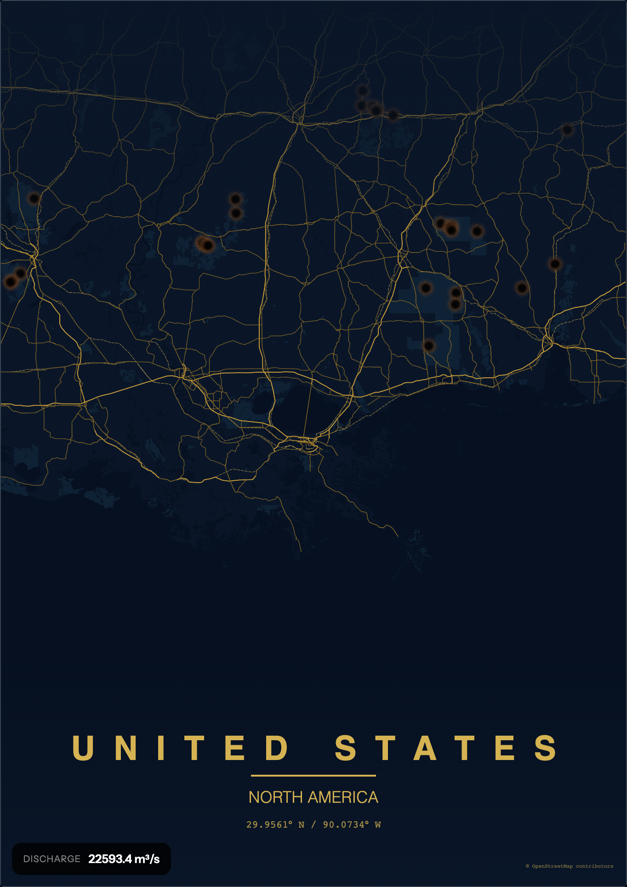
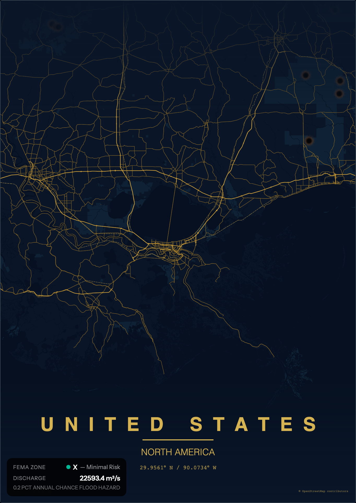

# SurgeInk

> **Multi-hazard risk visualization engine.** Render FEMA flood zones as ink bleeds and NASA EONET wildfires as paper burn marks on themed cartographic posters.

[](https://react.dev/)
[](https://www.typescriptlang.org)
[](https://vitejs.dev)
[](https://maplibre.org/)
[](https://fastapi.tiangolo.com)
[](https://www.python.org)
[](https://www.docker.com)

SurgeInk extends [TerraInk](https://github.com/yousifamanuel/terraink)'s cartographic poster engine with real flood and disaster data. Pick any location, turn on a hazard layer, and the map transforms — flood zones soak into the paper like spilled ink, wildfires burn through as charred holes.

## What makes it different

Unlike typical GIS overlays that drop generic red polygons and glowing dots onto a map, SurgeInk treats hazards as **physical media marks on paper**:

- **Floods** render as soft ink bleeds — a 3-layer stack of blurred halo + core wash + concentrated edge, colors derived from the active theme so water always looks like it belongs
- **Wildfires** render as organic paper burn marks — procedurally generated canvas textures with charred black centers, ember rings, and scattered ash flecks
- All other disaster types use a layered glow effect appropriate to the event kind

---

## Showcase

### Flood — ink bleed effect
FEMA flood zones along the Gulf Coast, rendered as organic ink wash on the Heatwave theme. Colors adapt to the active palette.


### Wildfires — paper burn marks
NASA EONET wildfire events across the southern US, rendered as charred holes burned through the poster.



### Combined
Both layers active on a dark theme.



---

## Features

- **Multi-hazard overlays** — flood zones (FEMA NFHL), disasters (NASA EONET), river discharge (Open-Meteo)
- **Theme-adaptive rendering** — hazard colors derive from the active map theme, never clash with the base cartography
- **Procedural effects** — canvas-rendered burn marks with seeded variants, multi-octave noise, Catmull-Rom smoothing
- **Live data** — all sources free and public, no API keys required
- **Risk score card** — floating summary of FEMA zone + live discharge for the current location
- **Discharge sparkline** — 7-day river discharge forecast, chartable via recharts
- **All of TerraInk** — themes, layouts, markers, typography, high-res PNG/SVG/PDF export

## Data sources

| Source | What it provides | Access |
|---|---|---|
| [FEMA NFHL](https://www.fema.gov/flood-maps/national-flood-hazard-layer) | US flood zones (AE, VE, X, etc.) | Free ArcGIS REST, proxied through the SurgeInk backend for CORS |
| [NASA EONET v3](https://eonet.gsfc.nasa.gov/) | Active disasters — wildfires, storms, volcanoes, floods, earthquakes, landslides | Free, no auth, proxied with 10 min cache |
| [Open-Meteo Flood API](https://open-meteo.com/en/docs/flood-api) | River discharge forecasts (wraps GloFAS v4) | Free, no auth, proxied with 6 hr cache |
| [OpenStreetMap](https://www.openstreetmap.org) | Base map data | Via MapLibre + OpenFreeMap |
| [Nominatim](https://nominatim.openstreetmap.org) | Location search / geocoding | Proxied via backend |

## Tech stack

**Frontend:** React 18 · TypeScript · Vite · MapLibre GL · recharts · Bun/npm

**Backend:** Python 3.11 · FastAPI · httpx · Redis (optional cache, graceful degradation)

**Architecture:** Feature-based vertical slices with hexagonal/ports-and-adapters pattern. See [agent.md](./agent.md) for details.

## Architecture

Monorepo. Frontend at root, Python backend in `server/`.

```
surgeink/
├── src/
│   ├── core/                     # Ports, adapters, config, services
│   ├── features/
│   │   ├── poster/               # Core state (PosterContext)
│   │   ├── location/             # Geocoding, search
│   │   ├── map/                  # MapLibre rendering
│   │   ├── theme/                # Color themes
│   │   ├── flood/                # FEMA flood zones (ink bleed)
│   │   └── disaster/             # NASA EONET events (burn marks)
│   ├── shared/                   # Geo math, utils, UI atoms
│   └── styles/                   # Global CSS
├── server/
│   └── surgeink/
│       ├── main.py               # FastAPI app
│       ├── api/                  # Route handlers
│       ├── data/                 # External API clients
│       └── cache/                # Redis wrapper
├── scripts/                      # Playwright capture scripts
└── docker-compose.yml            # Full stack (frontend + api + redis)
```

## Run locally

### Frontend

```bash
bun install    # (or npm install)
bun run dev    # → http://localhost:5173
```

### Backend

```bash
cd server
pip install -r requirements.txt
uvicorn surgeink.main:app --host 127.0.0.1 --port 8000
```

Backend runs at `http://localhost:8000`. Swagger docs at `/api/docs`.

Set `VITE_SURGEINK_API_URL=http://localhost:8000` in your `.env` if the backend is not on the default port.

### Redis (optional)

The backend uses Redis for caching but degrades gracefully if it's unreachable. For local dev you can skip it entirely. In production:

```bash
docker run -d -p 6379:6379 redis:7-alpine
```

## Docker deployment

```bash
docker compose up -d --build
```

Starts three services:
- **frontend** on `http://localhost:7200` (nginx serving built Vite app)
- **api** on `http://localhost:8000` (FastAPI)
- **redis** on `localhost:6379` (caching layer)

Stop:

```bash
docker compose down
```

## Environment variables

See [`.env.example`](./.env.example) for all available variables.

**Frontend:**
- `VITE_SURGEINK_API_URL` — backend URL (defaults to `http://localhost:8000`)

**Backend:**
- `SURGEINK_ENV` — `development` or `production`
- `SURGEINK_API_PORT` — default `8000`
- `REDIS_URL` — optional, defaults to `redis://redis:6379/0` in Docker

## Backend API

| Endpoint | Status | Description |
|---|---|---|
| `GET /api/health` | Working | Health check |
| `GET /api/v1/geocode` | Working | Nominatim proxy |
| `GET /api/v1/forecast` | Working | Open-Meteo river discharge |
| `GET /api/v1/layers` | Working | Layer catalog |
| `GET /api/v1/fema/zones` | Working | FEMA flood zones as GeoJSON |
| `GET /api/v1/disasters` | Working | NASA EONET events as GeoJSON |
| `GET /api/v1/risk` | Stub | Composite risk (Phase 3) |
| `POST /api/v1/predict` | Stub | ML inference (Phase 4) |
| `GET /api/v1/interpret` | Stub | Model interpretability (Phase 4) |

## Roadmap

- [x] Phase 1 — FastAPI skeleton + Open-Meteo + Nominatim + layer catalog
- [x] Phase 2 — FEMA flood zones with ink-bleed rendering
- [x] Phase 3 — NASA EONET disasters with paper burn marks
- [ ] Phase 4 — Composite risk scoring endpoint
- [ ] Phase 5 — ML flood risk prediction + interpretability layer
- [ ] Phase 6 — JRC Global Surface Water + WRI Aqueduct climate scenarios (via Google Earth Engine)

See [SURGEINK_SPEC.md](./SURGEINK_SPEC.md) for the full technical spec.

## Acknowledgment

SurgeInk is built on top of [TerraInk](https://github.com/yousifamanuel/terraink) by [Yousif Amanuel](https://github.com/yousifamanuel) (MIT). TerraInk provides the cartographic poster engine — themes, layouts, map rendering, export. SurgeInk adds the hazard visualization layers, Python backend, and live data integration.

TerraInk itself is inspired by [MapToPoster](https://github.com/originalankur/maptoposter) by [Ankur Gupta](https://github.com/originalankur) (MIT).

## License

MIT — see [LICENSE](./LICENSE).
